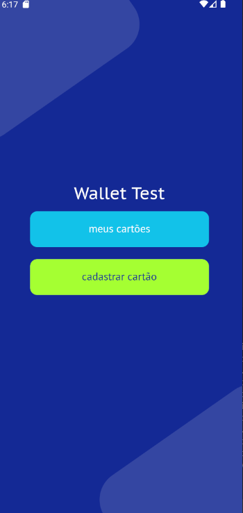
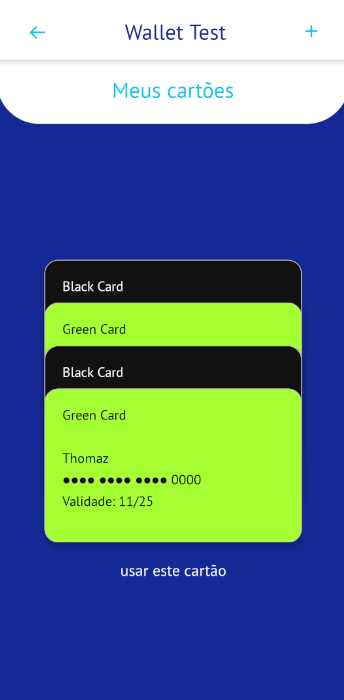
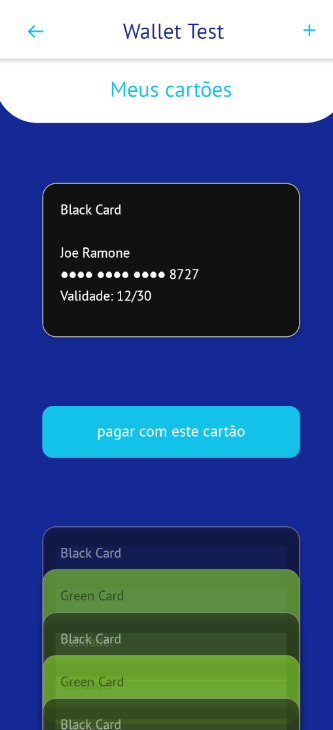
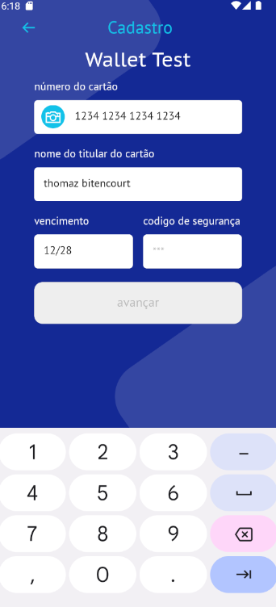
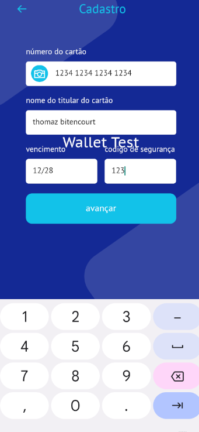

Esse é um projeto em [**React Native**](https://reactnative.dev), utilizando [`@react-native-community/cli`](https://github.com/react-native-community/cli).

# instruções

>após clonar o projeto na sua máquina, é preciso instalar as dependências utilizadas no projeto;

>para isso basta rodar o comando:
```bash
# usando npm
npm install 

# OU usando Yarn
yarn 
```
## passo 1: iniciar o servidor Metro 

primeiro você precisará iniciar o **Metro**

para iniciar o **metro** você precisa estar na raiz do projeto e rodar:

```bash
# using npm
npm start

# OR using Yarn
yarn start
```

## passo 2: iniciar sua Applicação

deixe o Metro rodar em seu terminal próprio. abra uma nova janela de terminal na raiz do seu projeto. Rode o seguinte comando para iniciar seu aplicativo _Android_ ou _iOS_:

### para Android

```bash
# usando o npm
npm run android

# Ou usando o Yarn
yarn android
```

### para iOS

```bash
# usando npm
npm run ios

# OU usando Yarn
yarn ios
```

se todo seu ambiente estiver configurado corretamente, você poderá ver a aplicação rodando ino seu emulador _Android ou iOS_ 


## passo 3: Rodando o Json-server

a aplicação foi desenvolvida com uma api falsa utilizando o json-server

abra um janela do terminal na raiz do projeto e rode o comando:

```bash
# usando o npm
npm run backend

# Ou usando o Yarn
yarn backend
```
 

 

